# 第一课：安装 ComfyTV，生成第一张图，挑一张，裁一下

这一课从安装开始，到在空白画布上用 Qwen Image 2.1 一次出 4 张图，在图片选择器里挑一张，再接一个裁剪节点。做完你会看到 ComfyTV 最核心的一点：**结果会实时往下游传**。换一张图、改一下裁剪框，后面的节点立刻跟着变，不需要重新运行。

---

## 一、安装 ComfyTV

**1. 安装 ComfyTV（两种方式选一种）**

**方式一：ComfyUI 桌面版**

在 ComfyUI 桌面版点击 `管理拓展功能`，搜索 `ComfyTV`，版本选择 `每夜`，安装。

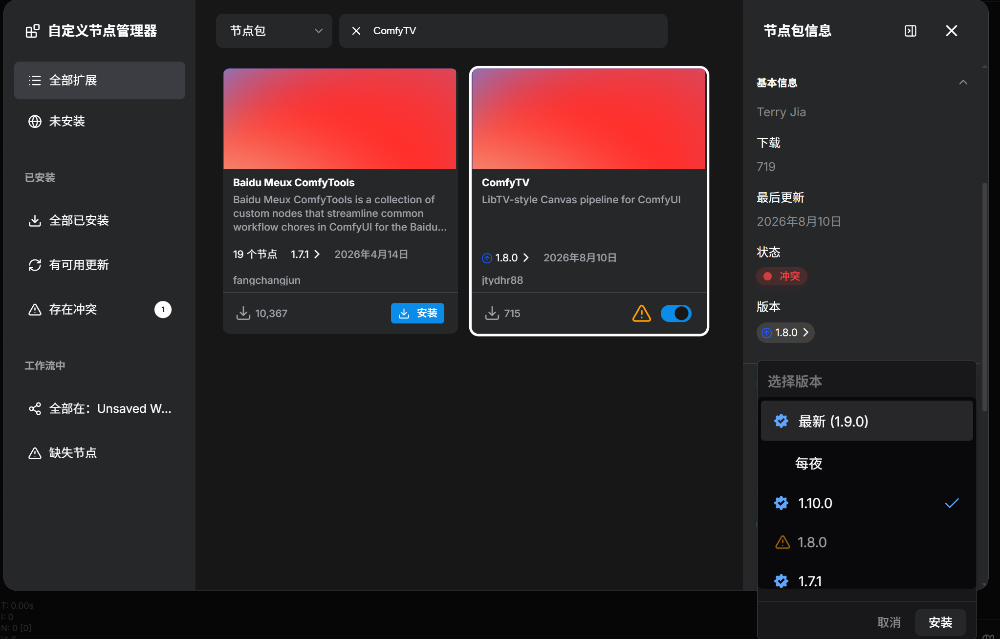

**方式二：命令行**

在 ComfyUI 目录下的 `custom_nodes` 文件夹里打开命令行，执行：

```
git clone https://github.com/jtydhr88/ComfyTV
```

执行完后，`custom_nodes/ComfyTV/` 下第一层就能看到 `__init__.py`。

**2. 完整重启 ComfyUI**

关掉 ComfyUI 再重新启动（桌面版就退出程序重开）。只刷新浏览器是不够的。

**3. 下载模型**

本课用的 Qwen Image 2.1 需要三个模型文件（int8 一套约 17 GB），放进 ComfyUI 的 `models` 下对应目录：

| 文件 | 放到 |
|---|---|
| `qwen_image_2.1_int8_convrot.safetensors` | `models/diffusion_models/` |
| `qwen3vl_8b_int8_convrot.safetensors` | `models/text_encoders/` |
| `qwen_image_2.1_vae_bf16.safetensors` | `models/vae/` |

下载地址：<https://huggingface.co/Comfy-Org/Qwen-Image-2.1>。ComfyUI 需要 v0.37 或更新版本。

---

## 二、打开 Nodes 2.0 和 ComfyTV V2

ComfyTV 的卡片界面（V2）建立在 ComfyUI 的 Nodes 2.0 之上，两个开关都要打开，这是后面所有课程的前提。

**1. 打开 ComfyUI 的 Nodes 2.0**

点左下角的 **设置**（或按 `Ctrl + ,`），在 **Comfy** 分类最上面找到 **现代节点设计（Nodes 2.0）**，打开。

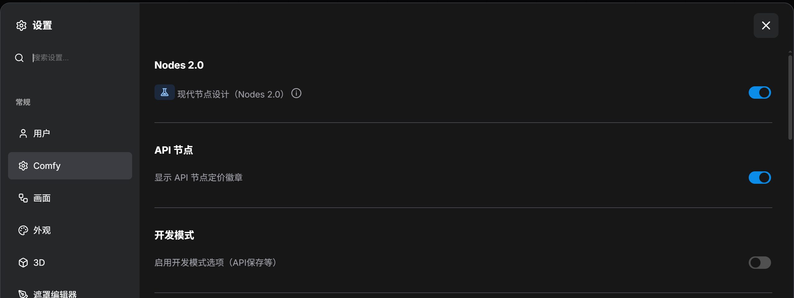

**2. 打开 ComfyTV V2**

点左侧栏的 **ComfyTV** 图标打开 ComfyTV 侧边栏，切到最右边齿轮图标的 **设置** 页，搜索 `V2`，打开 **启用 ComfyTV V2 节点**，点上方的 **保存**，然后**刷新页面**。

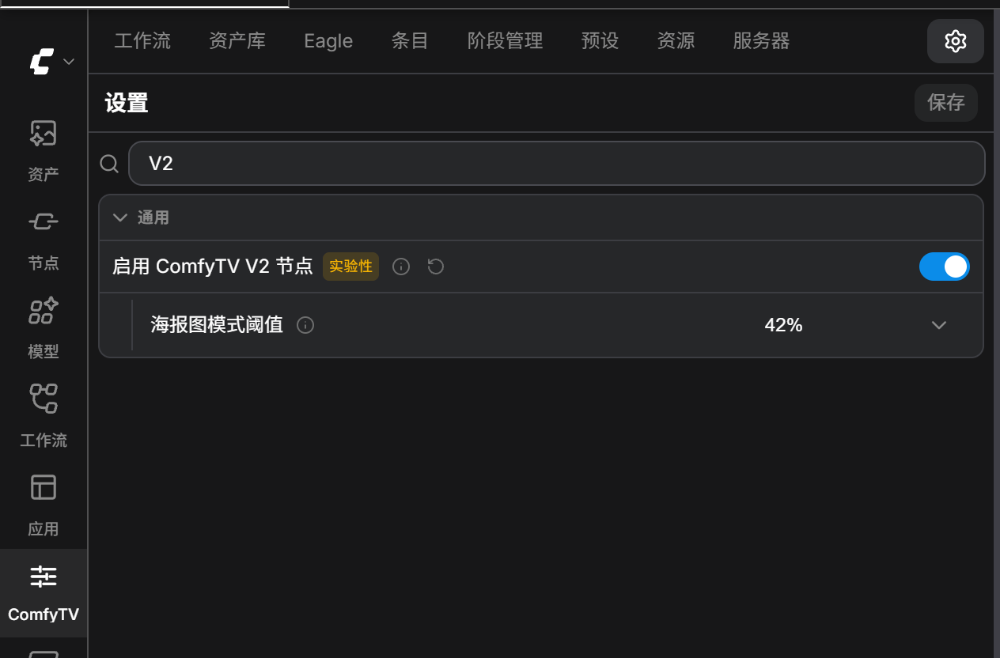

---

## 三、第一张图

### 第 1 步：添加图像阶段节点

新建一个空白工作流，在画布空白处**双击**打开节点搜索，输入 `图像阶段`，回车。

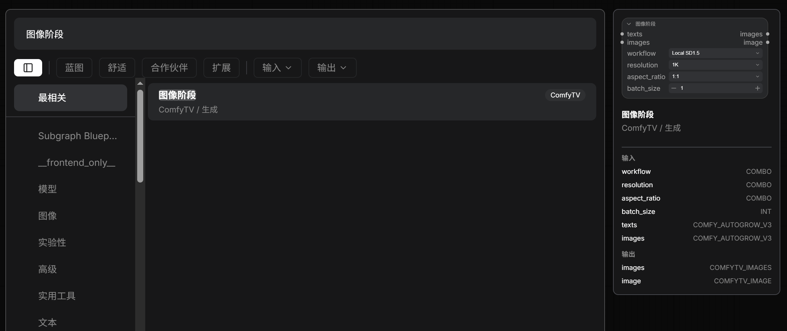

画布上出现一张「图像阶段 · 生成」卡片：

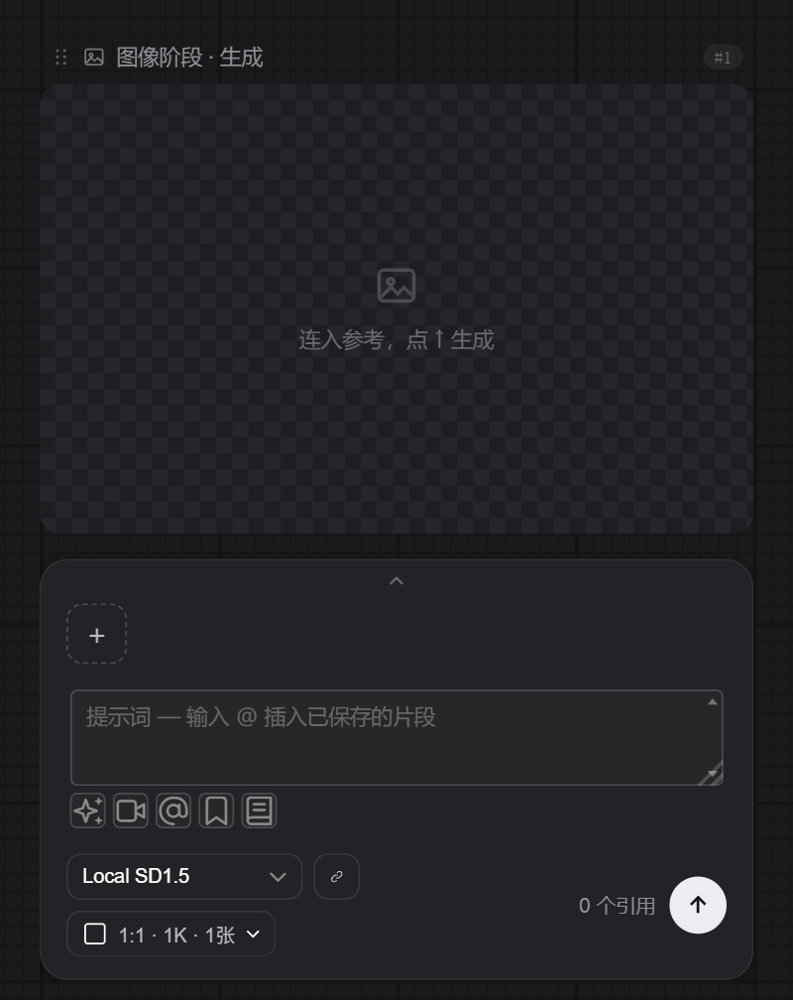

从上到下依次是：

- **预览区**：生成结果显示在这里。
- **提示词框**：输入你想要的画面。下面一排小图标是提示词助手、电影感相机、已保存的条目等，这一课先不用。
- **工作流下拉框**（左下）：选用哪个模型工作流。
- **生成选项**（`1:1 · 1K · 1张`）：比例、清晰度、张数。
- **↑ 按钮**：运行这张卡片。

> ComfyTV 里的每个节点都叫「阶段」（stage）：生成图像的是图像阶段，生成视频的是视频阶段，以此类推。

### 第 2 步：选 Qwen Image 2.1

卡片默认选的是 Local SD1.5。点工作流下拉框，选 **Qwen Image 2.1 T2I**。下拉框里列出的就是这个节点能用的所有工作流，后面的课会教你把自己的工作流加进来。

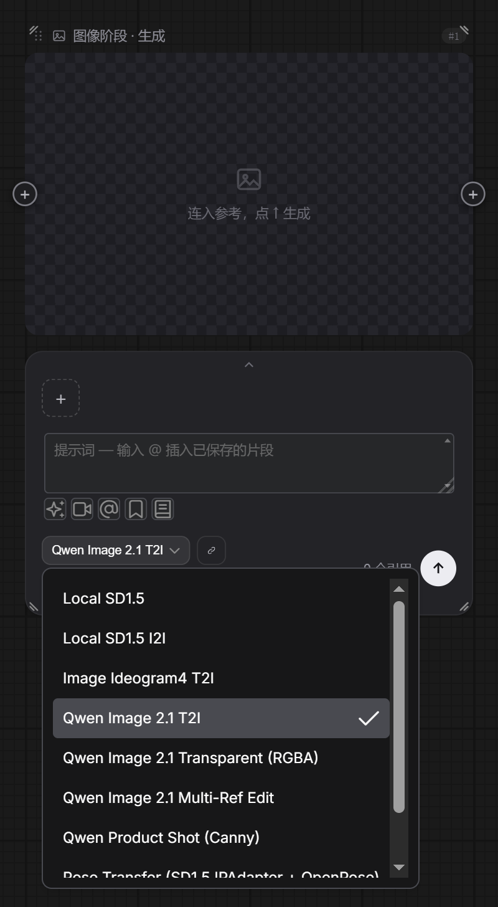

### 第 3 步：写提示词，设成一次出 4 张

Qwen Image 2.1 可以直接用中文写提示词。在提示词框里输入：

```
动漫插画，一个可爱的女孩，长着巨大的耳廓狐耳朵和蓬松的大尾巴，金色长卷发，蓝色眼睛，穿着温暖的针织毛衣，坐在阳光洒进窗边的咖啡馆里，柔和温暖的光线
```

点 `1:1 · 1K · 1张`，弹出生成选项：**清晰度**、**比例**、**生成数量**。生成数量选 **4张**，其余保持默认。

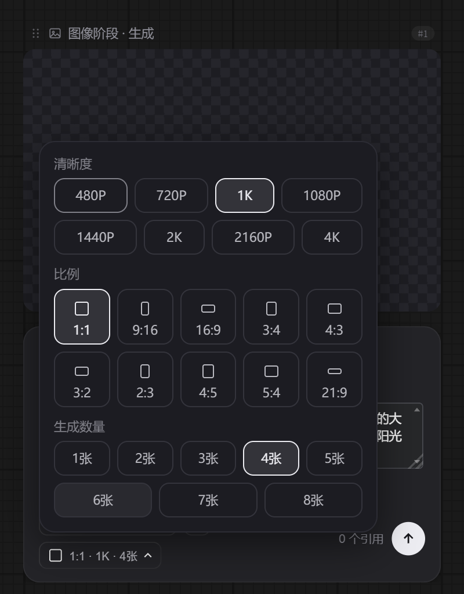

再点一下按钮收起弹窗，卡片准备好了：

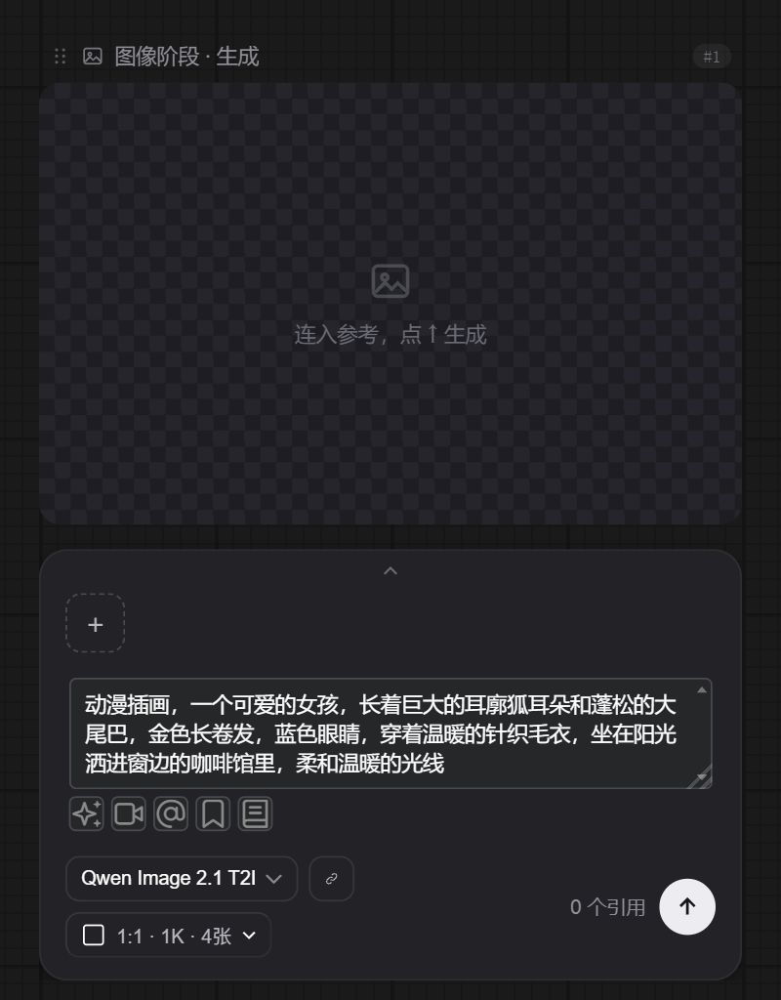

### 第 4 步：运行

点卡片右下角的 **↑**。预览区中间显示进度，↑ 变成红色的停止按钮，需要时可以点它中止。

同时你会发现，右边**自动多出了一个「图片选择器」**，并且已经连好线了：

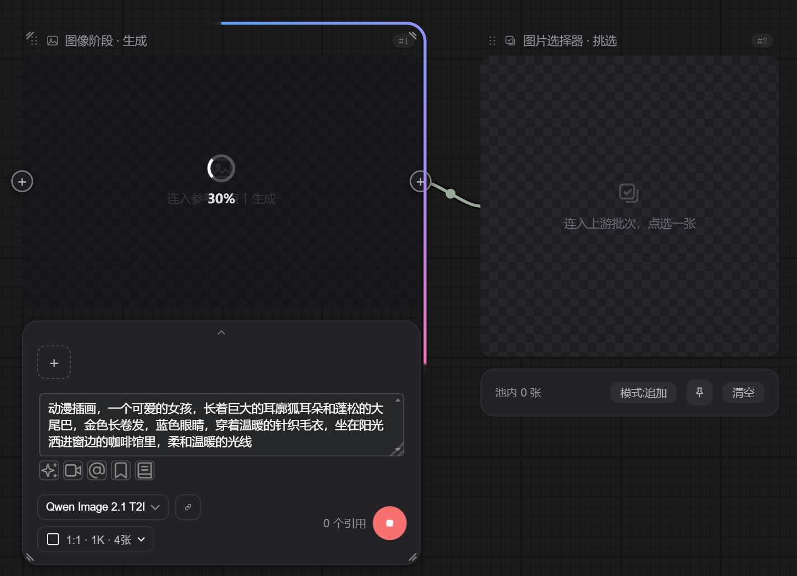

> **注意**：ComfyTV 的节点用卡片上自己的 ↑ 运行，每张卡片单独跑。顶部 ComfyUI 的 **运行** 按钮会跳过 ComfyTV 节点。

跑完后结果出现在预览区。右上角 `1/4张` 表示这一批有 4 张，当前看的是第 1 张；下面一行是格式、尺寸、文件大小和生成耗时。旁边的图片选择器也已经装进了这 4 张图（底部显示 `池内 4 张`）。

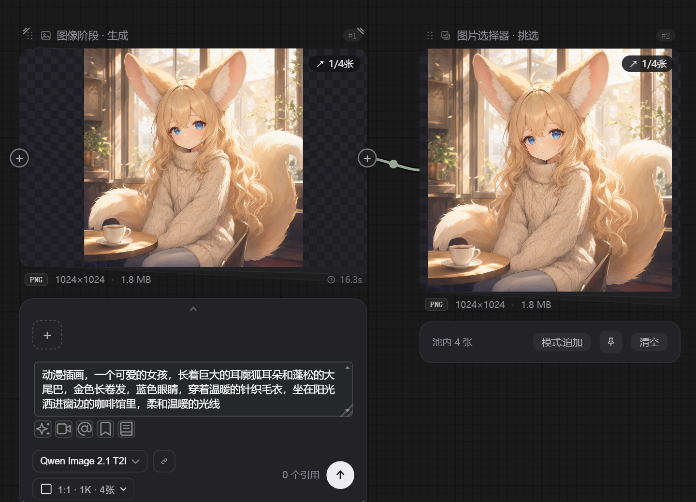

### 第 5 步：用图片选择器挑一张

一次出好几张时，通常要挑一张往下用，这就是 **图片选择器** 的作用。挑图有两种方式：

- 鼠标移到图上，用左右两侧的 **‹ ›** 切换；
- 点右上角的 **`1/4张`**，展开缩略图条，直接点你要的那张。


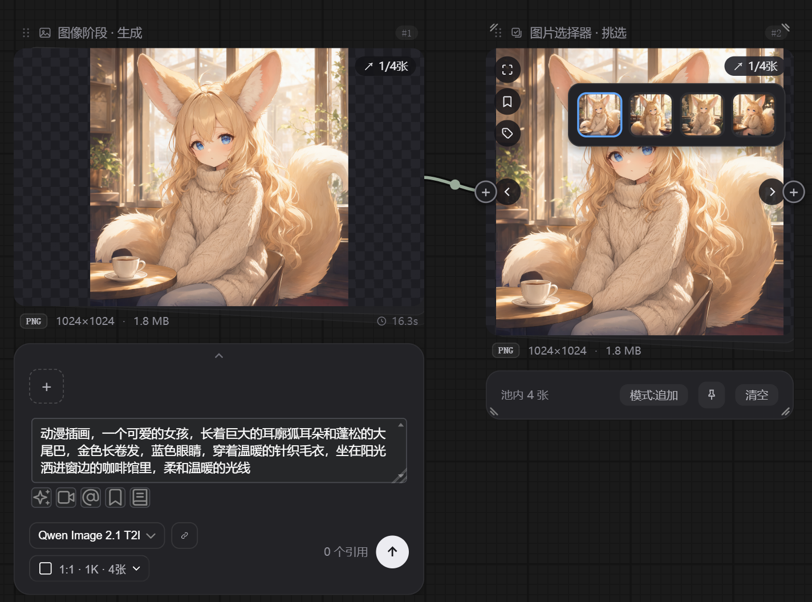

> 底部的 **模式:追加** 按钮决定再次运行上游时新结果怎么进池子：**追加** 保留旧的、新结果放到最前；点一下切成 **覆盖**，只保留最新一批。**清空** 清掉整个池子。

#### 图片选择器是怎么来的

这是 ComfyTV 的一个设置：**运行时自动接挑选节点**。打开时，图像阶段或视频阶段运行时，如果它的输出口**还没有连任何东西**，就自动在后面接一个图片 / 视频选择器。已经连了别的节点就不会再加。

它在侧栏 **ComfyTV → 设置** 里，搜索 `挑选` 就能找到，默认是开的：

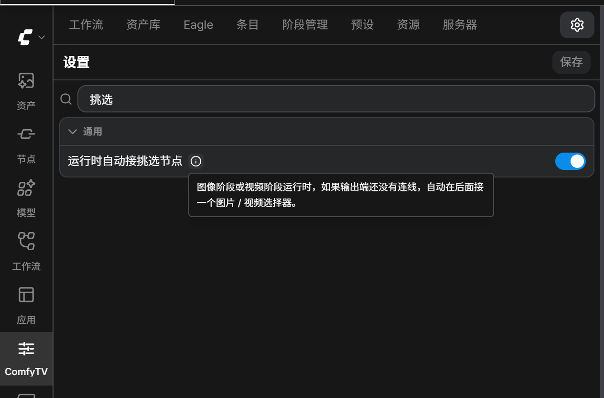

如果你更习惯自己决定后面接什么，可以把它关掉，点上方「保存」。关掉后，需要选择器时自己从输出口拖一个出来就行（方法见下一步）。

### 第 6 步：接一个裁剪节点，看结果实时传递

鼠标移到图片选择器**右侧的 ⊕**（输出口），按住往右拖，在空白处松手，会弹出一个菜单，选 **Search**：

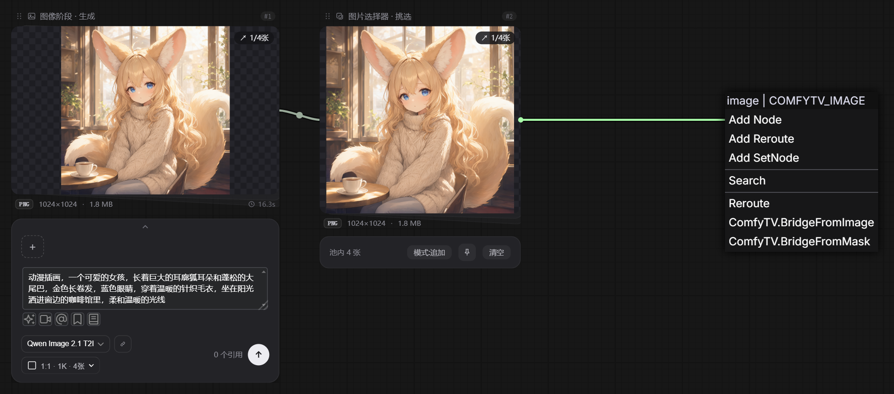

> 松手时**按住 Shift**，可以跳过菜单直接打开搜索框。

搜索框会自动只显示能接这个输出的节点。输入 `裁剪`，回车：

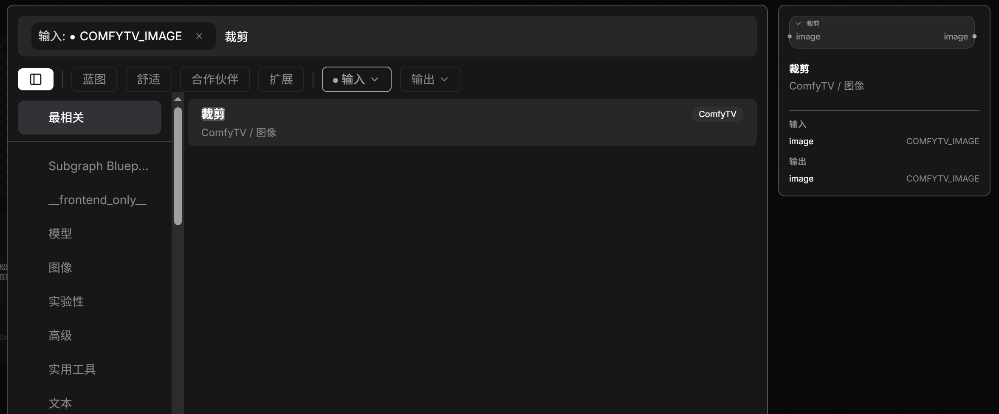

裁剪卡片一接上就拿到了图片选择器选中的图，并自动放好一个裁剪框。拖动框的四角调整范围，或者在下面的 **X / Y / W / H** 里直接输入数值；**比例** 可以锁定裁剪比例。卡片底部显示 **已应用 · 下游实时**，表示裁剪结果已经生效，并且会实时传给后面接的节点。

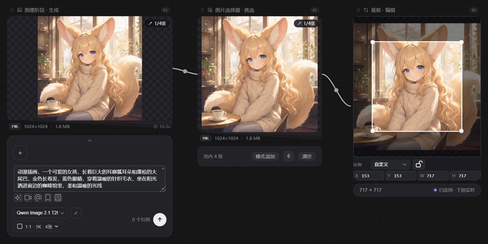

现在回到图片选择器，换成第 4 张图（右上角变成 `4/4张`）。**什么都不用点**，裁剪节点立刻换成了新图：

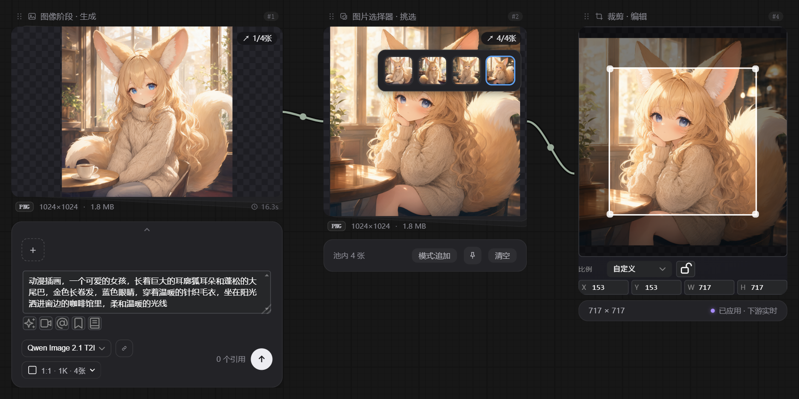

这就是 ComfyTV 的工作方式：

- **生成类节点**（图像阶段这种要跑模型的）用自己的 ↑ 运行，跑完结果留在卡片上；
- **挑选、裁剪这类编辑节点**不用运行，上游一变，它们就跟着更新，并继续往下游传。

所以你可以随便换图、调裁剪框，后面接的所有节点都会跟着变，不用每改一次就把整条链重跑一遍。

---

## 小结

| 你做了什么 | 学到了什么 |
|---|---|
| 安装 ComfyTV、下载 Qwen Image 2.1 模型 | 装好就能用，模型按表放进对应目录 |
| 打开 Nodes 2.0 和 ComfyTV V2 | 使用 ComfyTV 的前提 |
| 图像阶段 + Qwen Image 2.1 出 4 张 | 卡片的结构；用卡片自己的 ↑ 运行 |
| 运行后自动出现图片选择器 | 图片选择器挑图；「运行时自动接挑选节点」设置可以开关 |
| 从 ⊕ 拖出裁剪 | 拖出连线再搜索，只会列出能接的节点 |
| 换图，裁剪跟着变 | 编辑类节点不用运行，结果实时往下游传 |

**下一课**：把你自己的 ComfyUI 工作流接进 ComfyTV。
