# 第二课：接入你自己的工作流

上一课用的是 ComfyTV 自带的工作流。这一课把一个普通的 ComfyUI 工作流接进来：先在 ComfyUI 里存好，再回到 ComfyTV 关联它，然后做**绑定**，告诉 ComfyTV 卡片上的提示词、尺寸、张数、种子分别该填到工作流的哪个位置。最后再加一个卡片上原本没有的参数：采样步数。

学完这一课，任何一个 ComfyUI 文生图工作流，你都能用 ComfyTV 的卡片来驱动。

---

## 一、在 ComfyUI 里准备工作流

### 第 1 步：打开 Z-Image Turbo 模板

点左侧栏的 **模板**，搜索 `Z-Image Turbo`，打开 **Z-Image-Turbo: 文生图**。用你自己手上的工作流也完全可以，步骤一样。

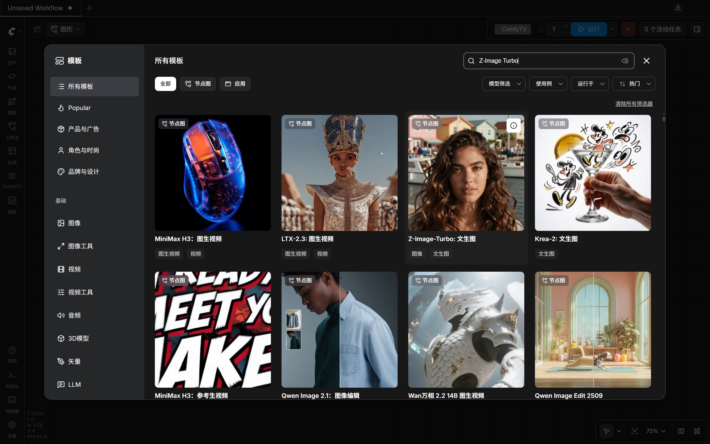

这个模板把加载模型、编码提示词、采样、解码这些节点都收进了一个子图「Text to Image (Z-Image-Turbo)」里，画布上只露出 prompt、width、height、seed、steps 这几个常用输入，后面接一个保存图像节点。

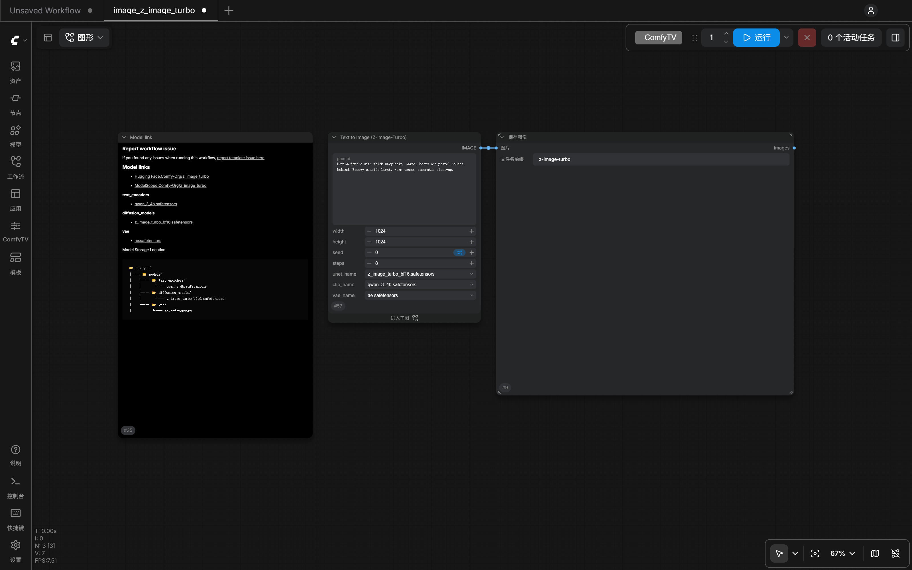

### 第 2 步：保存到工作流库

按 `Ctrl + S`（或点画布左上角「图形」右边的小箭头 → **保存**），起个好认的名字，比如 `Z-Image 文生图`，点确认。

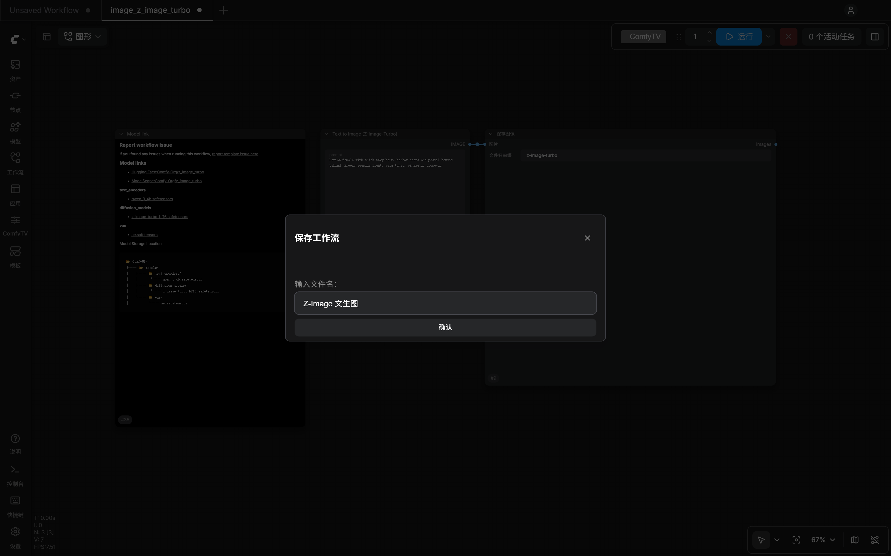

ComfyTV 关联的就是这里保存的工作流。以后在 ComfyUI 里修改并保存它，ComfyTV 下次运行时会自动用上新版本，不用重新导入。

---

## 二、在 ComfyTV 里关联

### 第 3 步：点卡片上的「关联工作流」

切回原来的工作流标签页（或新建一个），双击画布空白处，搜索 `图像阶段` 加一张卡片。工作流下拉框右边那个链条小图标就是 **关联工作流**。

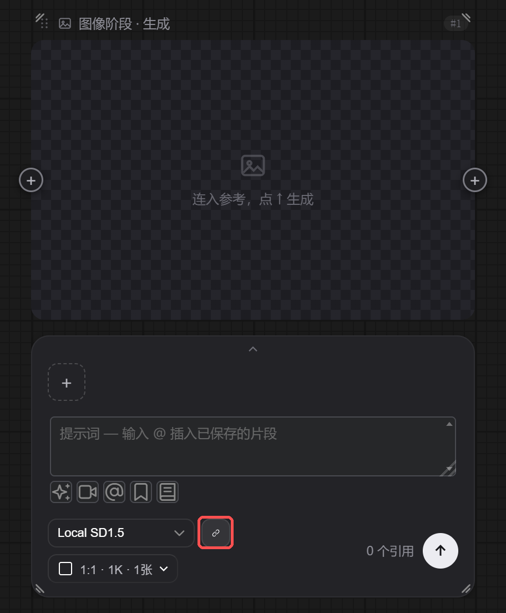

在哪种阶段上点，工作流就关联到哪种阶段。文生图工作流要在图像阶段上关联，视频工作流就在视频阶段上关联。

### 第 4 步：搜索并链接

弹出的窗口列出了 ComfyUI 工作流库里的所有工作流。搜索 `Z-Image`，点 **链接**。

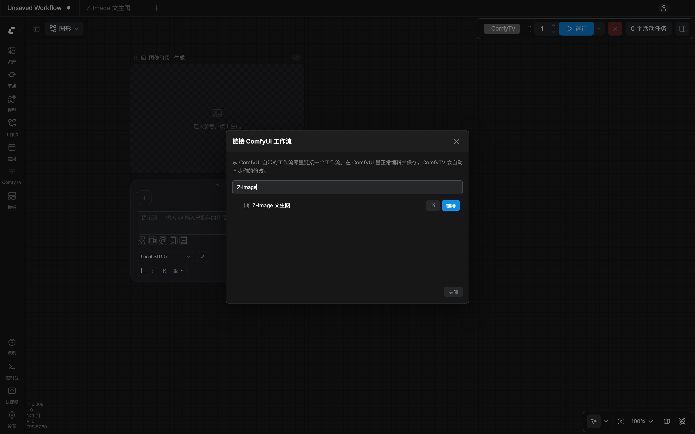

这一项旁边变成 **已链接**（右上角也会短暂提示一下），卡片的工作流下拉框自动切到了「Z-Image 文生图」。点 **解除** 可以取消关联。

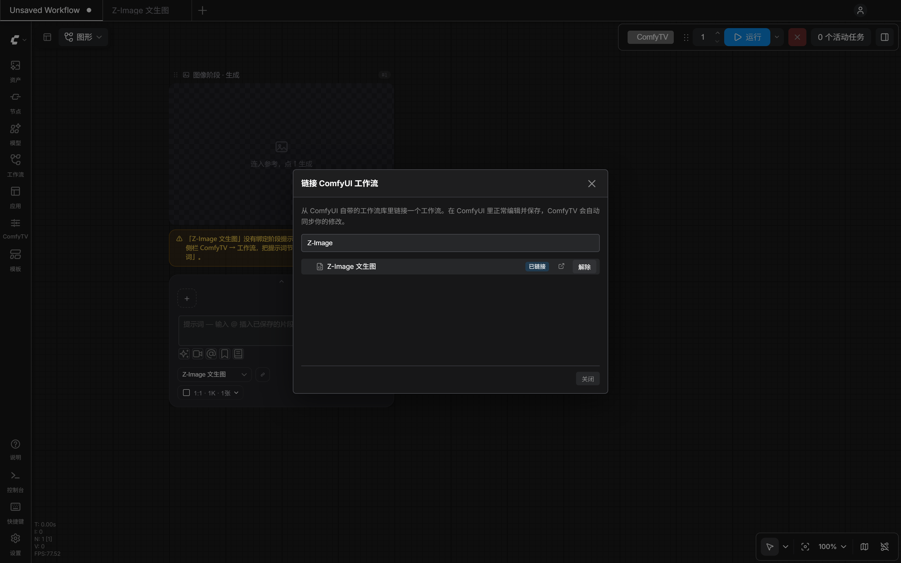

> 以前还有两种添加工作流的方式：在卡片上「上传工作流」，或者把 JSON 文件直接放进 `user/comfytv/workflows/` 下对应的文件夹。这两种都是旧方式，已不推荐，V2 卡片上也不再有上传按钮。请统一用关联。

### 第 5 步：看到黄色提示，别急着运行

关闭窗口，卡片上多了一条黄色提示：

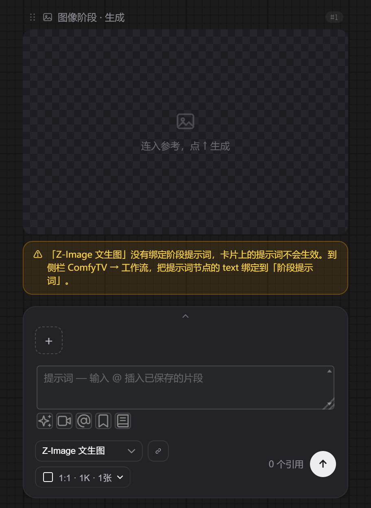

> **注意**：关联只是让 ComfyTV「认识」了这个工作流，**还没有建立任何对应关系**。这时直接运行，卡片上写的提示词、选的比例和张数统统不会生效，工作流会原样用文件里保存的值去跑。下一步的绑定就是来解决这个问题的。

---

## 三、绑定：把卡片上的参数接到工作流里

### 为什么需要绑定

ComfyTV 的卡片只有一套固定的控件：提示词、清晰度、比例、张数。而每个工作流的写法都不一样：提示词可能在 CLIP Text Encode 里，也可能在别的文本节点里；宽高可能在 Empty Latent 里，也可能在某个缩放节点里。ComfyTV 不会去猜，需要你告诉它一张**对应表**：

> 工作流里**哪个节点的哪个输入**，取卡片上的**哪个值**。

点 ↑ 运行时，ComfyTV 先复制一份你的工作流，按这张表把卡片上的值写进去，没写进对应表的输入保持文件里原来的值，然后运行，再把保存图像节点的结果取回卡片。你的工作流文件本身不会被改动。

### 第 6 步：打开工作流配置

在画布上**点选这张卡片**，再点左侧栏的 **ComfyTV** 图标，切到 **工作流** 页。

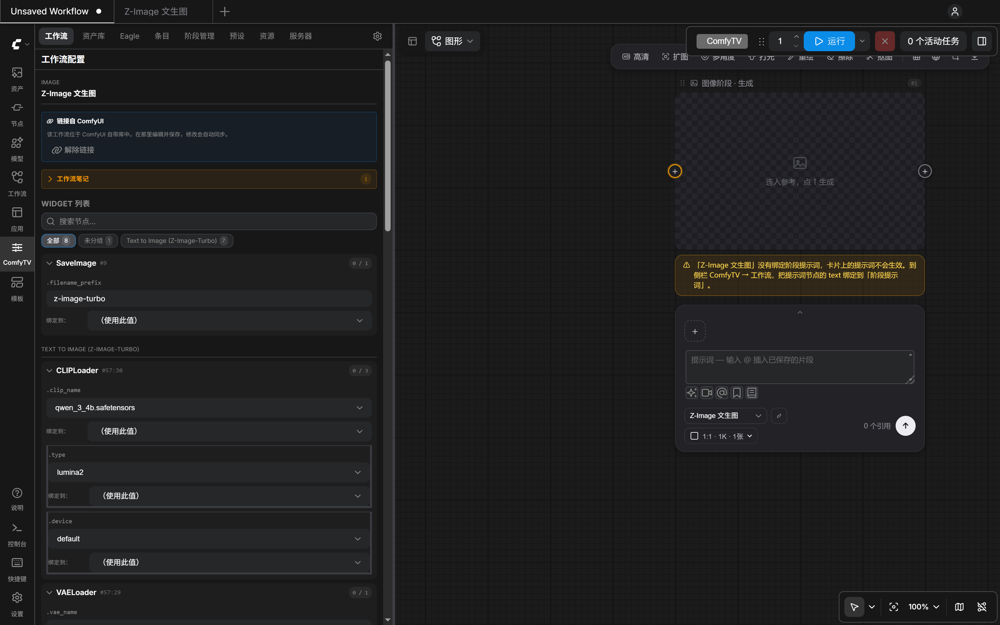

上面写着当前工作流的名字和「链接自 ComfyUI」。如果工作流里有笔记节点（这个模板自带一份模型下载说明），会显示在 **工作流笔记** 里，点标题可以折叠。往下是 **Widget 列表**，上方可以搜索节点，或按子图筛选：工作流里每个节点能填的输入都列在这里。子图里的节点也会展开列出来，编号形如 `#57:27`，冒号前是子图，冒号后是子图里的节点。

每个输入下面都有一个 **绑定到** 下拉框，默认是 **（使用此值）**，意思是用工作流文件里存的值。

### 第 7 步：绑定提示词

找到 **CLIPTextEncode** 的 `.text`，把 **绑定到** 改成 **阶段提示词**。

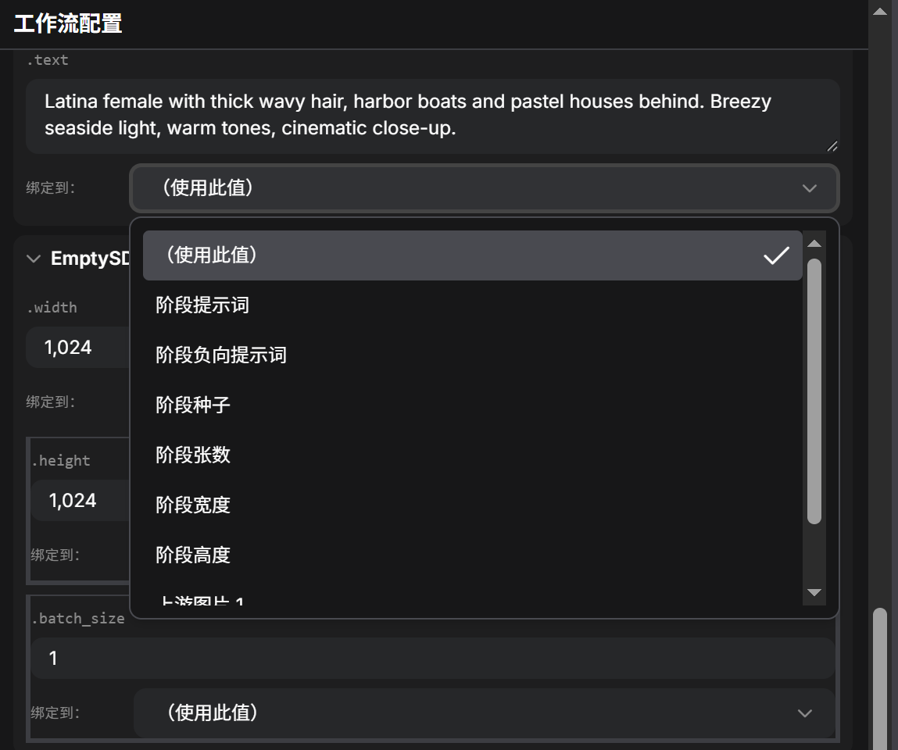

改完马上生效，不需要保存。这时卡片上的黄色提示也消失了。

### 第 8 步：绑定宽、高、张数和种子

用同样的方法再绑四个：

| 节点 · 输入 | 绑定到 | 取的是卡片上的什么 |
|---|---|---|
| CLIPTextEncode · `text` | 阶段提示词 | 提示词框里的文字（连进来的文本会拼在后面） |
| EmptySD3LatentImage · `width` | 阶段宽度 | 由「清晰度 + 比例」算出的宽 |
| EmptySD3LatentImage · `height` | 阶段高度 | 由「清晰度 + 比例」算出的高 |
| EmptySD3LatentImage · `batch_size` | 阶段张数 | 生成数量（1–8 张） |
| KSampler · `seed` | 阶段种子 | 每次运行自动换一个随机种子 |

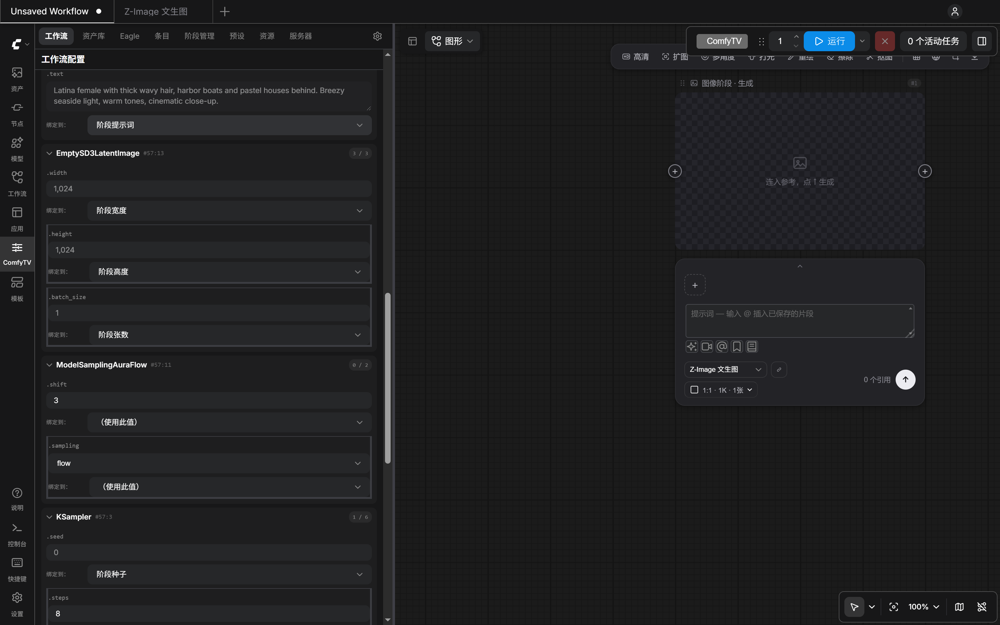

几点说明：

- **宽高是算出来的**：短边取清晰度档位（1K = 1024，2K = 2048），长边按比例换算，再取整到 8 的倍数。比如 1K + 16:9，短边 1024，长边 1024 × 16 ÷ 9 ≈ 1820，取整后是 **1816 × 1024**。
- **种子每次都不同**：绑定到阶段种子后，每次运行都会随机换一个，同一个提示词可以连续出不同的图。
- **没绑定的输入不受影响**：steps、cfg、模型文件这些仍然用工作流里保存的值。想改它们，要么回 ComfyUI 改了再保存，要么用下一部分讲的自定义参数。

### 第 9 步：运行验证

回到卡片，写一段提示词，生成选项设成 **16:9 · 1K · 2张**：

```
清晨的海边小镇，彩色房子沿着港口排开，渔船停在码头，柔和的晨光，电影感广角镜头
```

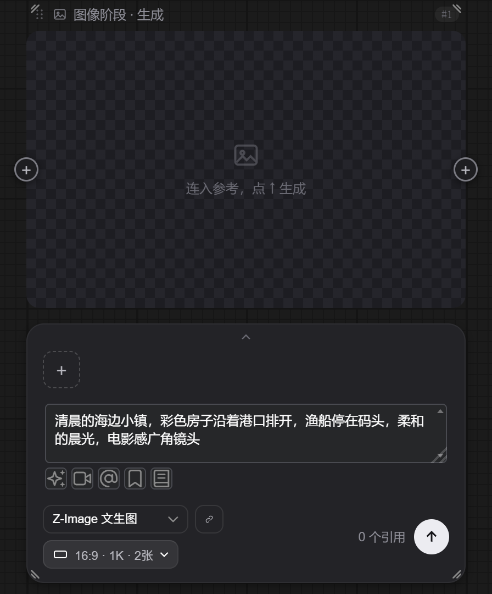

点 ↑。跑完后卡片显示 `1/2张`、`1816×1024`：张数、比例、提示词都按卡片上的设置生效了。第一次运行要加载模型，会慢一些。右边照例自动接上了一个图片选择器。

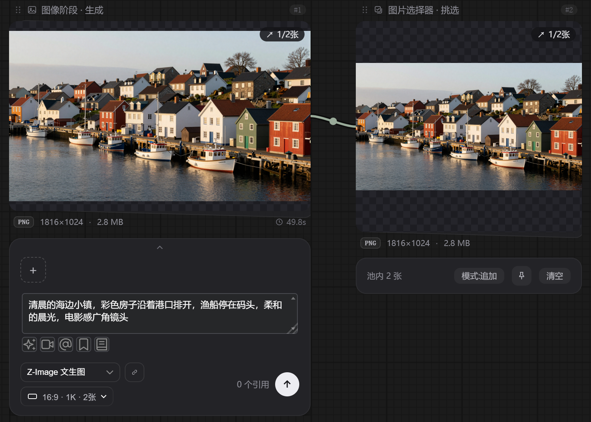

---

## 四、自定义参数：把卡片上没有的参数也拿出来

图像阶段的卡片只自带提示词、尺寸、张数这几样。但很多工作流还有自己想调的东西，比如采样步数、CFG、LoRA 强度。这些可以做成**自定义参数**：在卡片上加一个控件，再像上面一样绑定到工作流里。下面用采样步数举例。

### 第 10 步：新建参数

打开 ComfyTV 侧栏的 **阶段管理** 页，右上角的类型选 **image**（默认是 text）（自定义参数按阶段类型区分，图像阶段的参数只出现在图像阶段上）。在 **参数 → 新建参数** 里填：

- **名称**：采样步数
- **类型**：int（整数）
- **最小值 / 最大值 / 步长**：1 / 30 / 1。最小值和最大值都填了，卡片上就会显示成滑块。
- **默认值**：8

点 **创建**。

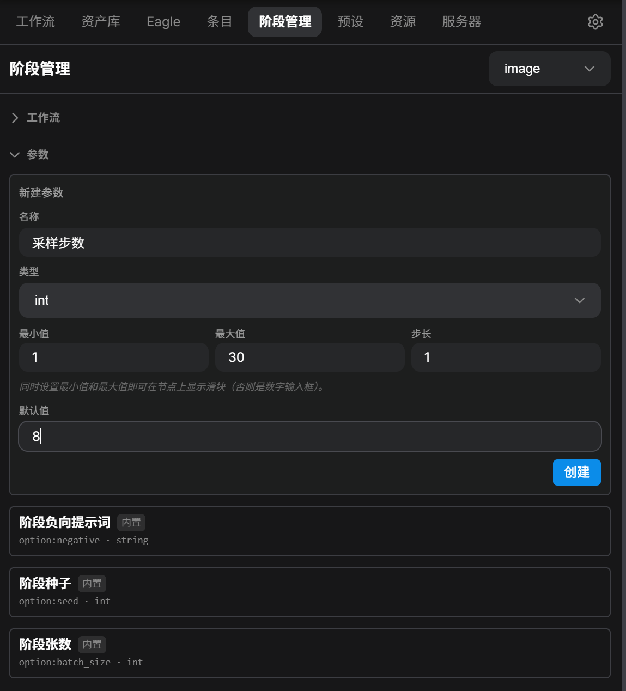

下面的列表里还能看到图像阶段自带的三个内置参数：阶段负向提示词、阶段种子、阶段张数。

### 第 11 步：绑定到工作流

回到 **工作流** 页，找到 **KSampler** 的 `.steps`。打开 **绑定到**，刚建的 **采样步数** 已经出现在选项里，选它。

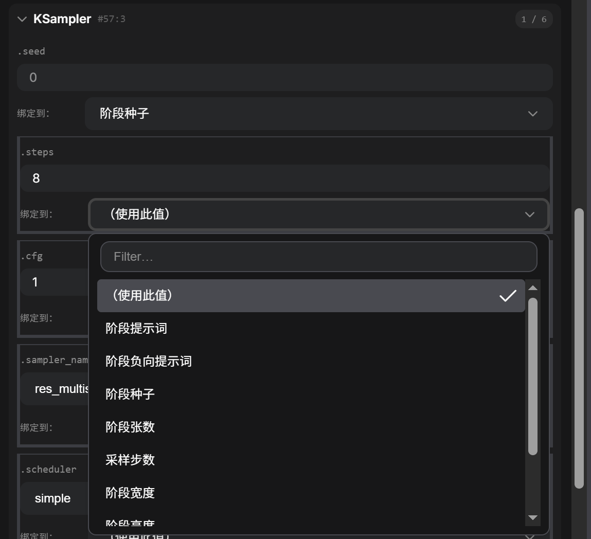

### 第 12 步：在卡片上挂出来

回到卡片，提示词下面多出了 **工作流参数** 一行（建了自定义参数之后才会出现）。点右边的 **+ 添加**，选 **采样步数**。

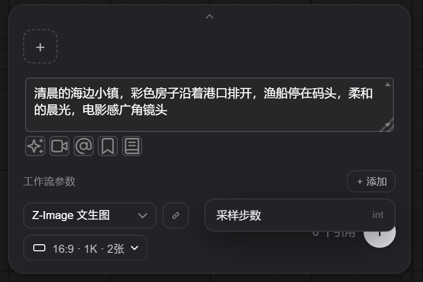

卡片上多了一个采样步数滑块，默认值是 8。右边的 **−** 可以把它从这张卡片上移除。

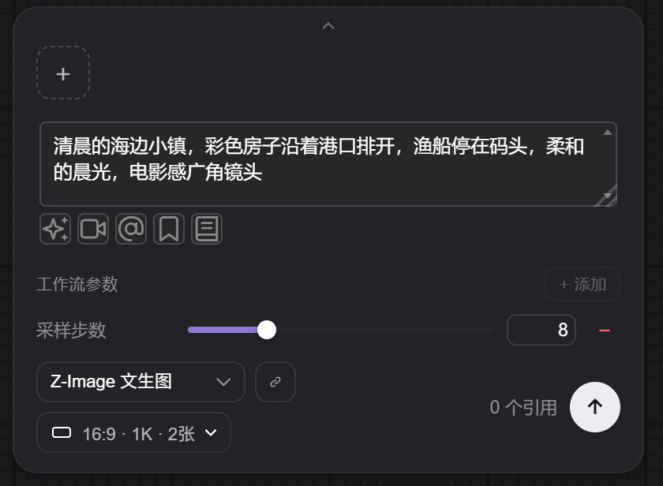

把它拖到 **4**，再运行一次。工作流这次只采样 4 步（ComfyUI 后台日志里能看到 `4/4`），两张图一共只用了 **5.2 秒**。

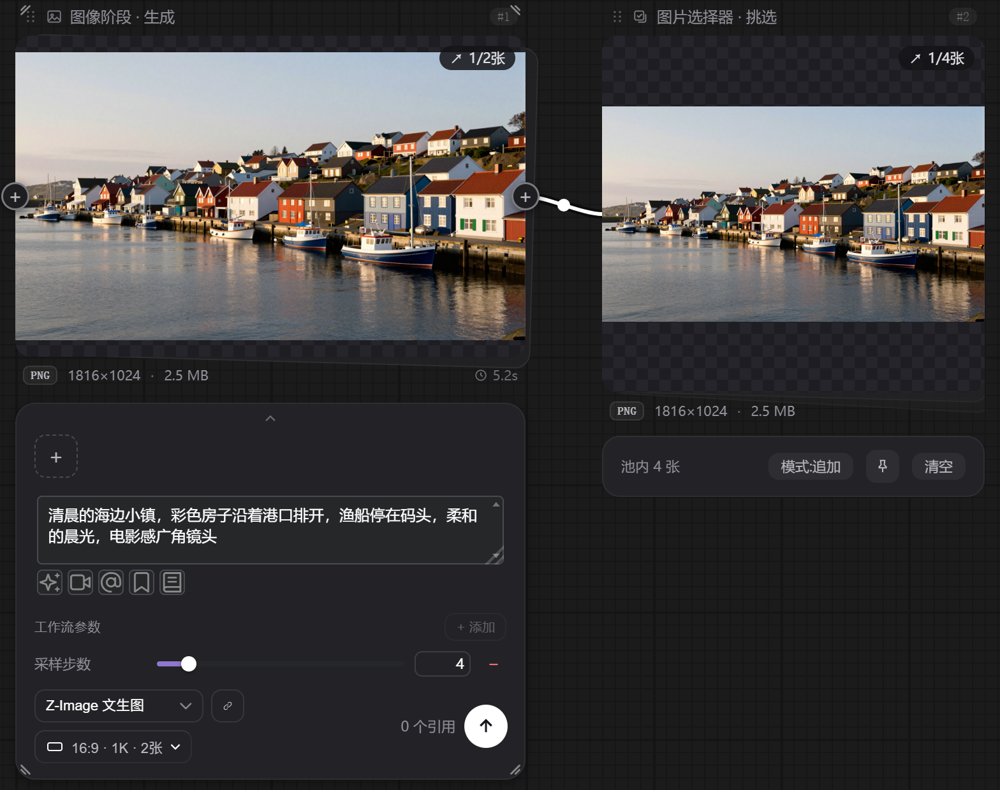

> 参数建好之后，所有图像阶段卡片都能挂这个参数。没挂到卡片上时，运行用的是你设的默认值。

---

## 小结

| 你做了什么 | 学到了什么 |
|---|---|
| 在 ComfyUI 里打开模板、保存 | ComfyTV 关联的是 ComfyUI 工作流库里的工作流 |
| 在图像阶段上关联工作流 | 在哪种阶段上关联，就归到哪种阶段；关联后会自动同步修改 |
| 看到黄色提示 | 关联不等于能用，必须绑定 |
| 绑定提示词、宽、高、张数、种子 | 绑定 = 告诉 ComfyTV 卡片上的值填到工作流的哪个输入 |
| 新建「采样步数」并挂到卡片上 | 卡片上没有的参数，用自定义参数补上 |

**下一课**：自定义阶段：输入输出不是「提示词进、图片出」的工作流，也能接进 ComfyTV。
