# 第三课：资产库与参考引用

做角色、做系列图，最怕的是每张图里的人长得不一样。ComfyTV 的办法是**资产库**：把满意的图存进去，以后任何一张卡片都能把它当作参考图引用，再在提示词里用 `@图1`、`@图2` 指明「这张图里的谁、那张图里的什么」。

这一课先生成一个角色存进资产库，再上传一张场景图，最后在一张新卡片上同时引用这两张图，让角色站进场景里，脸和服装保持不变。

---

## 一、把生成的图存进资产库

### 第 1 步：生成一个角色

加一个图像阶段，工作流选 **Qwen Image 2.1 T2I**，生成选项设成 **3:4 · 1K · 1张**，提示词：

```
动漫角色设定图，全身，一个可爱的女孩，长着巨大的耳廓狐耳朵和蓬松的大尾巴，金色长卷发，蓝色眼睛，穿着米白色针织毛衣和蓝色长裙，红色围巾，站立正面，纯浅灰色背景
```

做角色参考图时，**全身、正面、纯色背景**最好用：人物信息完整，背景也不会干扰后面的合成。


> 跑完后画布上可能会自动多出一个图片选择器，这是 ComfyTV 的默认行为（侧栏「设置」里的「运行时自动接挑选节点」）。这一课用不到它，可以直接删掉。

### 第 2 步：存入资产库

鼠标移到预览图上，右上角会出现三个小按钮：

- **查看大图**：全屏查看。
- **作为资产节点加载**：存进资产库，同时在旁边放一个「从资产加载图片」节点，适合要连线使用的时候。
- **存入资产库 / 打标签**：存进资产库并选一个分类。

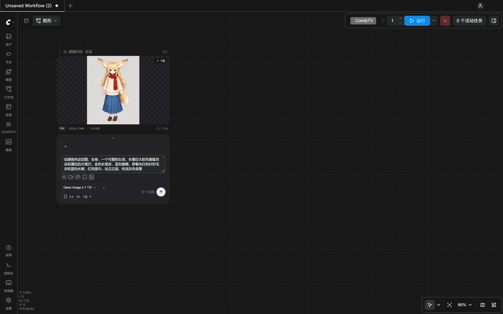

点 **存入资产库 / 打标签**，弹出分类菜单。第一次用时只有「未分类」，点 **＋ 新建分类**：

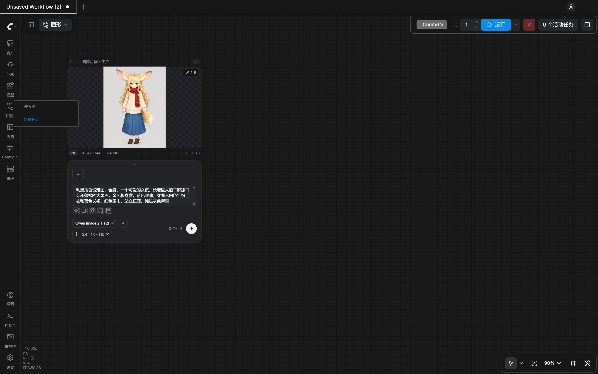

输入 `角色`，确定。这张图就存进了资产库，归在「角色」分类下。

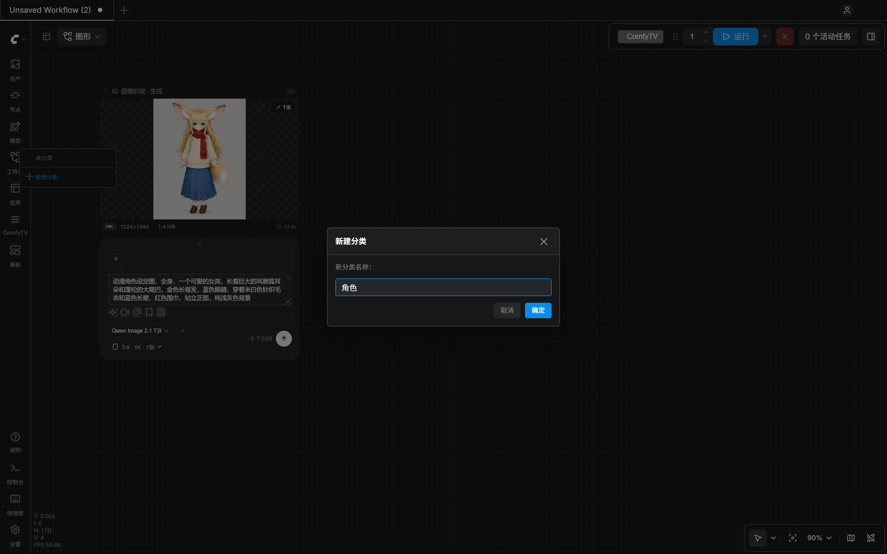

> 存入资产库不会复制文件，资产库记录的是这张图在 ComfyUI 输出目录里的位置。所以不要手动删除 `output` 里你存过的图。

---

## 二、在侧栏里管理资产

### 第 3 步：打开资产库

点左侧栏的 **ComfyTV** 图标，切到 **资产库** 页。刚才存的图在里面，下面标着「角色」。上方可以按分类、按类型（图片、视频、音频、3D 模型、文本）筛选，也可以搜索。

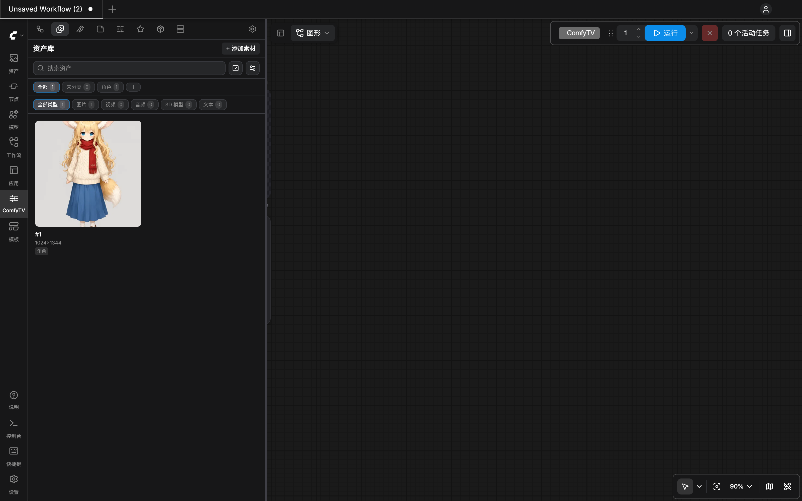

### 第 4 步：起个好认的名字

资产默认用卡片编号命名，比如 `#1`。在资产上**右键**，选 **重命名**，改成 `狐耳女孩`。右键菜单里还有查看大图、作为节点添加到画布、编辑标签、从资产库移除等操作。

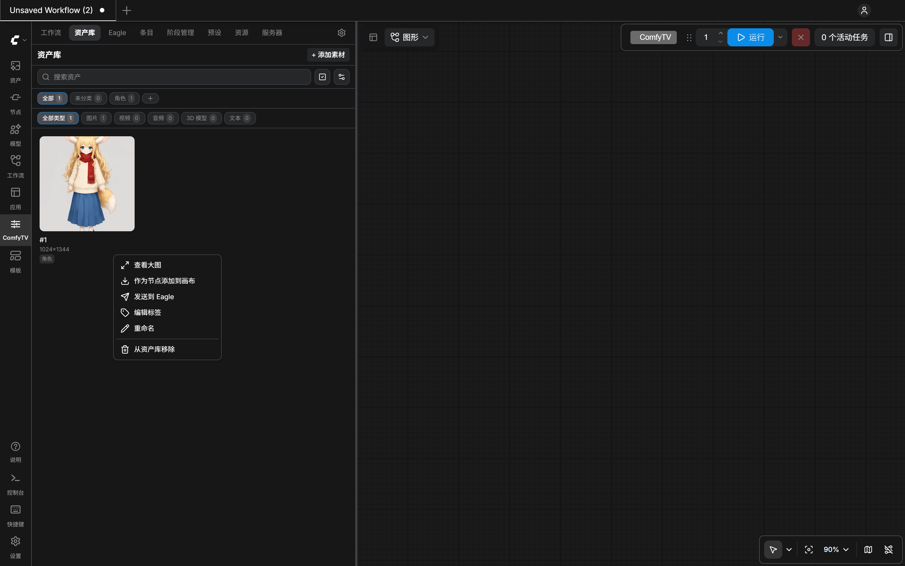

名字很重要：后面在提示词里 @ 引用时，列表里显示的就是这个名字。

### 第 5 步：上传一张场景图

资产库不只放生成的图，本地文件也可以放进来。点右上角 **＋ 添加素材**，选一张场景图（这里用第二课生成的海边小镇），或者直接把文件拖进面板。上传的资产会用文件名命名。

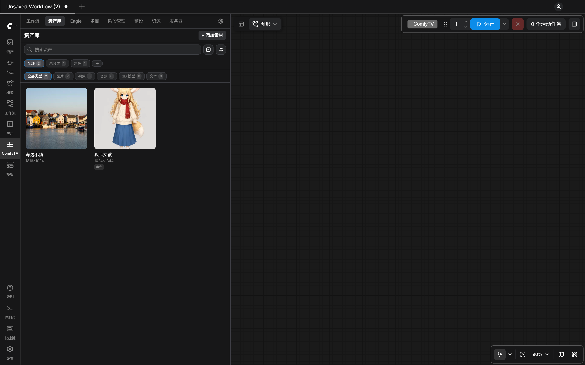

---

## 三、在另一张卡片上引用资产

### 第 6 步：加一个图像编辑卡片

在画布空白处双击，搜索 `图像编辑`，回车。

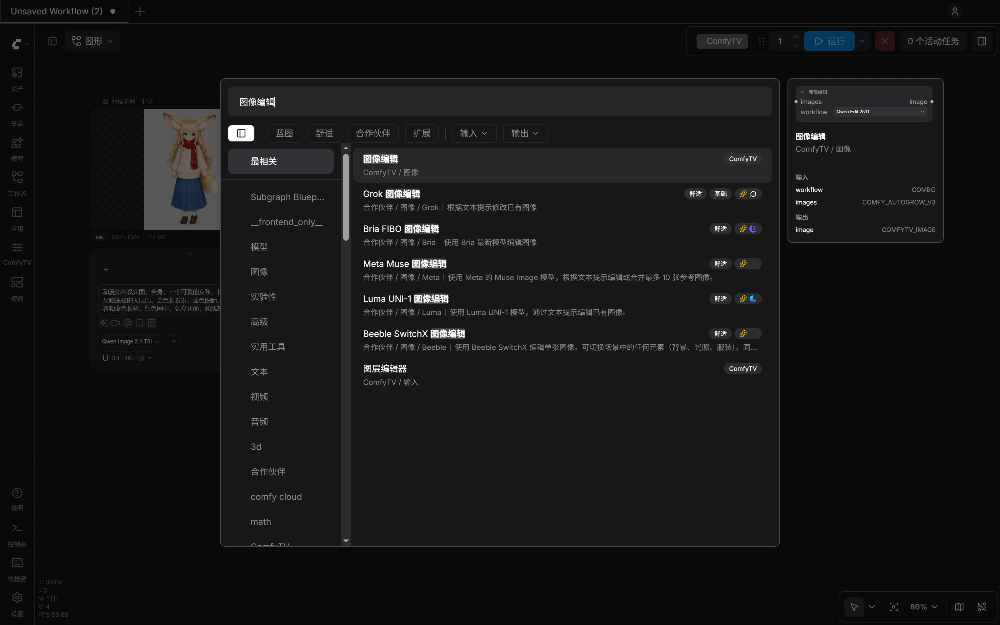

「图像编辑」是专门用来改图的阶段：给它几张参考图，再用文字说要怎么改。

### 第 7 步：工作流换成 Qwen Image 2.1 Edit

图像编辑默认选的是 Qwen Edit 2511，它只接收一张图。要同时引用角色和场景，把工作流换成 **Qwen Image 2.1 Edit**，它最多能接收 10 张图。

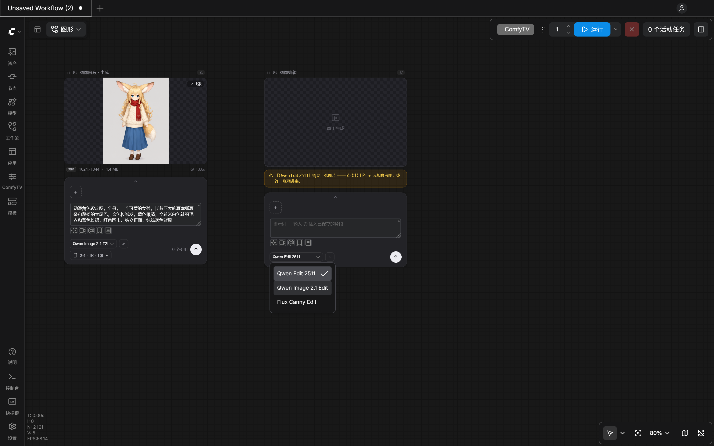

卡片上的黄色提示是在提醒你：这个工作流至少需要一张图，接下来就去添加。

### 第 8 步：添加参考素材

点参考区的 **＋**（添加参考素材），弹出资产选择框。**先点「狐耳女孩」，再点「海边小镇」**，被选中的会打上勾。

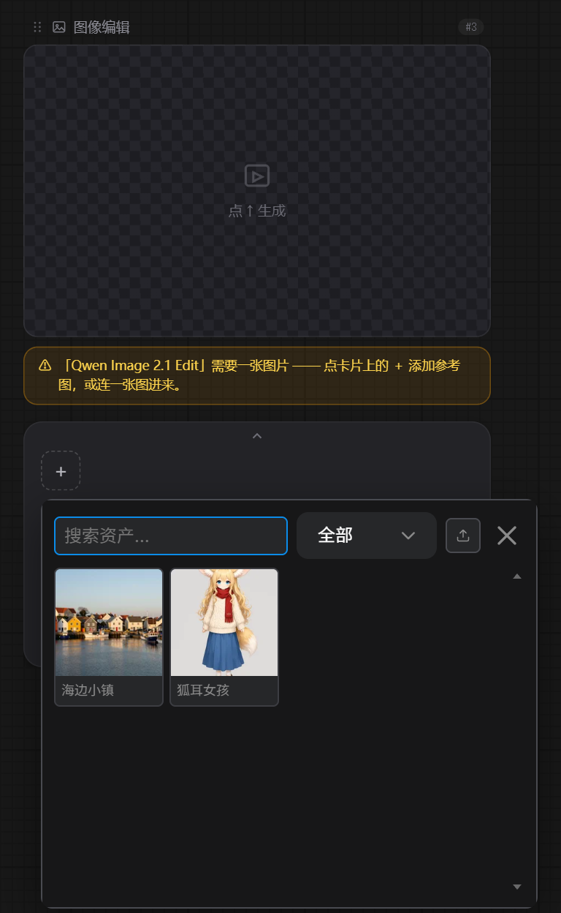

关闭选择框，卡片上多了两个带编号的缩略图：**1** 是狐耳女孩，**2** 是海边小镇。编号就是点选的顺序，黄色提示也消失了。

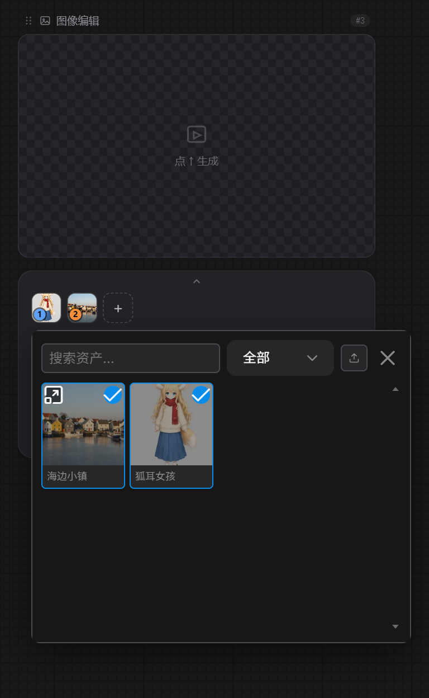

> **注意**：对 Qwen Image 2.1 Edit 来说，**图 1 是被编辑的那张图**，输出图的尺寸也跟图 1 一样；图 2 以后都是参考。所以要把主体放在第一位。

### 第 9 步：在提示词里 @ 引用

在提示词框里输入 `让`，再输入 `@`。弹出的列表最上面是 **已连接的输入**：`@图1 狐耳女孩`、`@图2 海边小镇`，带缩略图。选 `@图1`。

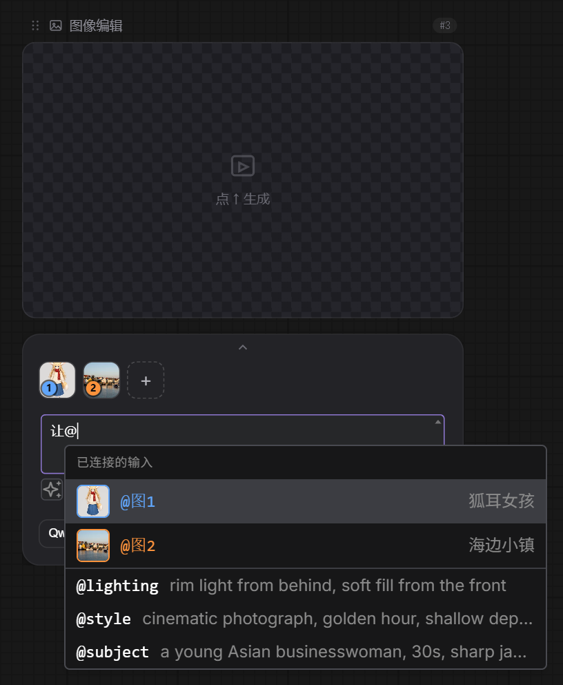

> 列表下面的 `@lighting`、`@style` 这些是「片段」，是存好的常用提示词，输入 @ 就能插入，后面的课会讲。

接着写完整句，第二个 @ 选 `@图2`：

```
让 @图1 中的女孩站在 @图2 的港口码头上，傍晚的暖光，保持她的脸、发型、耳朵尾巴和服装完全不变
```

提示词里的 `@图1`、`@图2` 会变成彩色标签，颜色和上面缩略图的编号颜色一一对应。

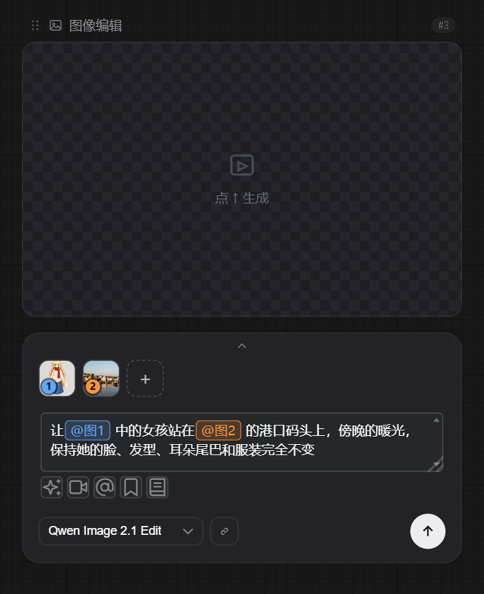

### 第 10 步：运行

点 ↑。十几秒后出图：

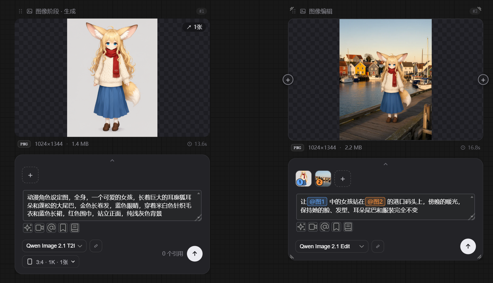

放大看，女孩的脸、耳朵、围巾、长裙都保持住了，背景换成了海边小镇的码头，光线也变成了傍晚的暖光。输出是 1024×1344，和图 1 的尺寸一致。

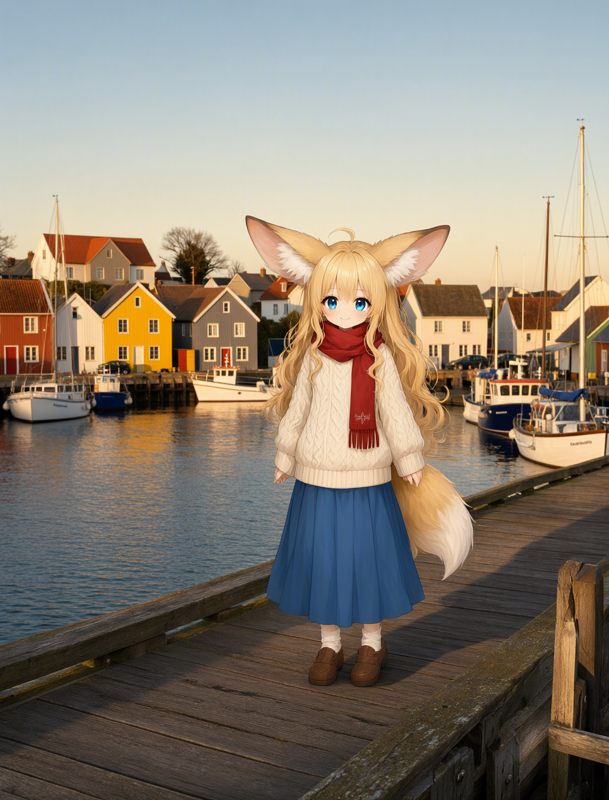

---

## 四、编号和引用是怎么对应的

### 调整顺序，@ 会自动跟着变

参考区的缩略图可以**拖动排序**。把海边小镇拖到最前面，它就变成了图 1，提示词里的标签也会**自动跟着改号**：原来写 `@图1` 指狐耳女孩的地方，现在显示成 `@图2`，指的还是狐耳女孩。

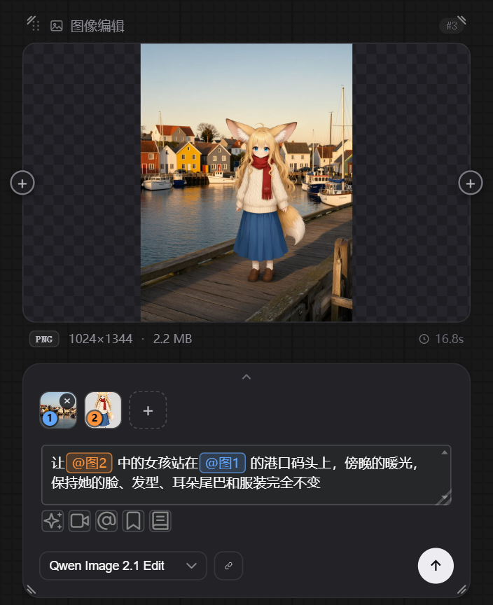

也就是说，`@` 标签认的是**那张图**，不是位置上的数字。不过对 Qwen Image 2.1 Edit 来说，排在第一位的图会被当成要编辑的那张。这一步演示完，记得把狐耳女孩拖回第一位。

### 提示词最后是怎么发给模型的

不同模型「认图」的写法不一样：Qwen Image 2.1 要写成 `<image1>`，MiniMax H3 要写成 `<Picture 1>`，有的模型只认自然语言「图1」。ComfyTV 的做法是：你在卡片上统一写 `@图1`，运行时按工作流的设置自动换成对应模型的写法。

这个设置在工作流配置里：选中卡片 → 侧栏 **ComfyTV** → **工作流** 页，拉到下面的 **工作流属性 → 引用**。内置的 Qwen Image 2.1 Edit 已经设好了 **&lt;image n&gt; 标签（Qwen Image 2.1）**。

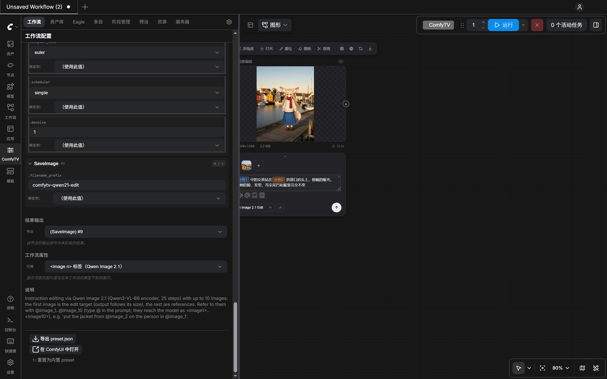

如果你关联的是自己的多图工作流（第二课的方法），记得在这里选对模型的格式，并把工作流里的 Load Image 节点绑定到 **上游图片 1**、**上游图片 2**……

### 资产被删了会怎样

如果参考区里某张图对应的资产后来从资产库移除了，或者文件丢了，它的缩略图会变成红框，并显示一个「!」。这时点运行，ComfyTV 会拦下来，提示「参考素材已失效」，告诉你是哪一张。从参考区移除它，重新添加，再运行即可。

---

## 小结

| 你做了什么 | 学到了什么 |
|---|---|
| 生成角色，点「存入资产库 / 打标签」 | 满意的图随时存进资产库，可以按分类整理 |
| 在侧栏资产库里重命名、上传场景图 | 资产名字会出现在 @ 列表里；本地文件也能放进来 |
| 图像编辑 + Qwen Image 2.1 Edit，＋ 添加两张参考 | 参考区的编号就是 @图N 的编号，图 1 是被编辑的那张 |
| 提示词里 @图1、@图2，运行 | 一句话指明哪张图的什么，角色保持一致 |
| 拖动排序、查看「引用」设置 | @ 认的是图不是位置；运行时自动换成模型能懂的写法 |

**下一课**：自定义阶段：输入输出不是「提示词进、图片出」的工作流，也能接进 ComfyTV。
